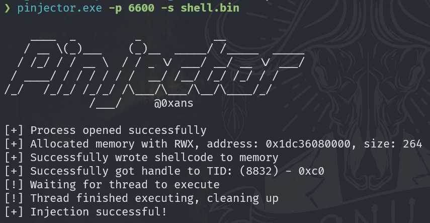

# Rust ShellCode Injector


## Author: 0xans

## Contact: Instagram: [0x.ans](https://instagram.com/0x.ans)

```
    ____  _         _           __            
   / __ \(_)___    (_)__  _____/ /_____  _____
  / /_/ / / __ \  / / _ \/ ___/ __/ __ \/ ___/
 / ____/ / / / / / /  __/ /__/ /_/ /_/ / /    
/_/   /_/_/ /_/_/ /\___/\___/\__/\____/_/     
             /___/     @0xans    
```

## Description

This Rust tool made for injecting shellcode into processes on Windows.

## Requirements

- Rust (stable toolchain)
- Windows environment
- `cargo` package manager

## Installation

1. Clone the repository:
   ```bash
   git clone https://github.com/0xans/process-injector.git
   ```
2. Go to the project directory:
   ```bash
   cd process-injector
   ```
3. Build:
   ```bash
   cargo build --release --target x86_64-pc-windows-gnu
   ```

## Usage

Run the injector by specifying the target process and the shellcode file:

```bash
./injector.exe -p <PID> -s <shellcode_file>
```

### Options:

- `-p`, `--pid`: The target PID for injection.
- `-s`, `--shellcode`: The path to the shellcode file (binary format).

## Example

To inject shellcode into a target process with PID `1234`:

```bash
./injector.exe -p 1234 -s ./shellcode.bin
```

## Issues?

For any questions or issues, reach out to me on Instagram: [0x.ans](https://instagram.com/0x.ans).
